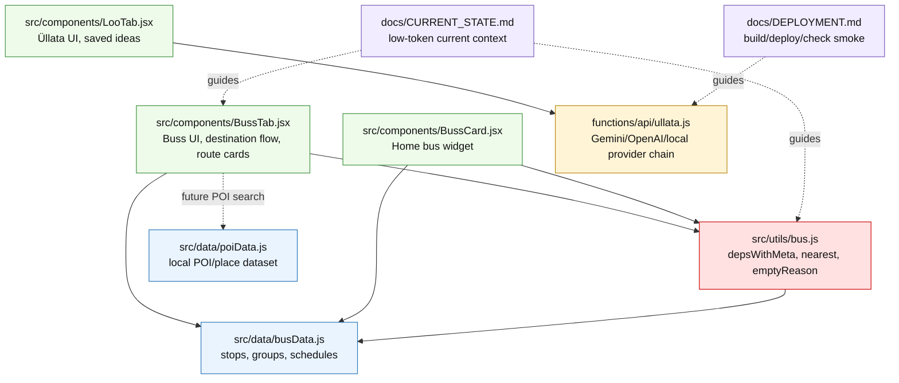

# AnniVibe — Workflow Optimization Plan

**Eesmärk:** vähendada Codexi/agentide tokenikulu, hoides samal ajal projekti turvalise, kontrollitava ja sammhaaval juhitavana.

See fail on mõeldud lisamiseks AnniVibe projekti allikatesse/dokumentatsiooni, et tulevased agentide tööpassid lähtuksid samast süsteemist.

---

## 1. Põhimõte

Codex peab olema **snaiper, mitte kuulipilduja**.

See tähendab:

- üks kitsas pass korraga;
- ainult vajalikud failid lugemiseks;
- ainult lubatud failid muutmiseks;
- vaikimisi ei tehta docs-sync’i iga väikse koodipassi järel;
- runtime/UI passid saavad buildi ja vajadusel live-smoke’i;
- commit tehakse alles pärast kontrolli;
- järgmine pass algab alles inimese selge käsuga.

---

## 2. Uus vaikimisi read-first reegel

Tulevased Codexi passid loevad vaikimisi ainult:

```txt
AGENTS.md
docs/CURRENT_STATE.md
<konkreetse passi jaoks vajalikud failid>
```

Mitte vaikimisi:

```txt
docs/ACCEPTED_CHECKPOINTS.md
docs/AUDIT_FINDINGS_BACKLOG.md
docs/TRUTH_INDEX.md
kogu src/
kogu docs/
kogu repo
```

Neid loetakse ainult siis, kui pass seda päriselt vajab.

---

## 3. Passide kolm klassi

| Klass | Millal kasutada | Loe | Muuda | Docs update |
|---|---|---|---|---|
| **Surgical** | Üks fail / väike kood või data muutus | `AGENTS.md`, `CURRENT_STATE.md`, passifailid | ainult lubatud failid | vaikimisi ei |
| **Checkpoint** | build, smoke, deploy, commit, release state | status + seotud failid | docs/checkpoint või mitte midagi | ainult kui vaja |
| **Architecture** | suunamuutus / uus loogikamudel | plan docs + vajadusel Claude input | ainult docs | jah |

Näited:

| Pass | Klass |
|---|---|
| `PASS 25C — LOCAL_POI_DATASET_RAKVERE` | Surgical |
| `PASS 25D — PLACE_SEARCH_UI_NO_MAP` | Surgical |
| `PASS 25H — LIVE_FIELD_TEST` | Checkpoint |
| `PASS 25B — PLACE_DESTINATION_MODEL_DOCS` | Architecture |
| `PASS 26C — CODEBASE_IMPACT_MAP_AND_SNIPER_MATRIX` | Architecture/docs |

---

## 4. Pass manifest formaat

Iga Codexi prompt peaks sisaldama lühikest manifesti.

```md
PASS_TYPE: surgical | checkpoint | architecture

READ:
- AGENTS.md
- docs/CURRENT_STATE.md
- <ainult vajalikud failid>

TOUCH:
- <ainult lubatud failid>

DO_NOT_TOUCH:
- <kaitstud failid/pinnad>

VALIDATE:
- <minimaalne vajalik kontroll>

DOCS:
- none | checkpoint | planning

STOP_AFTER:
- report only
```

See asendab pikki ajaloo- ja kontekstiplokke.

---

## 5. Docs update vaikereegel

Väiksed implementation/data passid **ei uuenda docs’e vaikimisi**.

Docs update tehakse siis, kui:

1. tootesuund muutus;
2. tekkis uus accepted checkpoint;
3. deploy/live-smoke kinnitas runtime/UI muudatuse;
4. uus mudel/fail vajab dokumenteerimist;
5. prompt ütleb selgelt `DOCS: yes`.

Näide:

```txt
poiData.js lisamine → no docs by default
place/POI model decision → docs yes
live smoke accepted → checkpoint docs yes
commit-only pass → docs no
```

---

## 6. Protected surfaces

Luua või hoida lühidokumendina:

```txt
docs/PROTECTED_SURFACES.md
```

Sisu peaks olema lühike:

```md
# Protected surfaces

## Bus engine
- src/utils/bus.js
- depsWithMeta(...)
- nearest(...)
- emptyReason(...)

## Bus data
- src/data/busData.js

## Bus UI
- src/components/BussTab.jsx
- src/components/BussCard.jsx

## POI data
- src/data/poiData.js

## Üllata
- src/components/LooTab.jsx
- functions/api/ullata.js

Rules:
- touch only when pass explicitly says so
- do not mix bus work with Üllata work
- do not add map inside non-map pass
```

---

## 7. Codebase impact map / sniper matrix

Luua:

```txt
docs/CODEBASE_IMPACT_MAP.md
```

Eesmärk: Codex näeb kohe, milline fail mille eest vastutab ja mida muudatus mõjutab.

### 7.1 Pass type → read/touch/validate matrix

| Pass type | Read | Touch | Never touch | Validate |
|---|---|---|---|---|
| `poi-data` | `CURRENT_STATE.md`, `poiData.js`, `busData.js` | `poiData.js` | `BussTab.jsx`, `bus.js`, `functions/*` | POI validation, build |
| `bus-ui` | `CURRENT_STATE.md`, `BussTab.jsx`, `bus.js`, `busData.js` | `BussTab.jsx` | `ullata.js`, `LooTab.jsx` | build, route smoke |
| `bus-engine` | `CURRENT_STATE.md`, `bus.js`, `busData.js` | `bus.js` | `Üllata`, unrelated UI | unit/source tests, heavy smoke |
| `ullata` | `CURRENT_STATE.md`, `LooTab.jsx`, `ullata.js` | `LooTab.jsx`, `ullata.js` | bus files | build, API smoke |
| `deploy` | `DEPLOYMENT.md`, status | none | source | build, deploy, canonical/API smoke |
| `docs` | relevant docs only | docs only | `src/`, `functions/`, `package*` | no build unless required |
| `map-picker` | `CURRENT_STATE.md`, `BUS_MAP_PICKER_PLAN.md`, `BussTab.jsx`, map component | map component, maybe `BussTab.jsx` | `bus.js` unless proven | build, mobile smoke |

### 7.2 Mermaid — codebase impact map



---

## 8. Validation scripts

Korduvad kontrollid tuleks skriptideks tõsta, et promptid oleksid lühemad.

Soovituslikud tuleviku failid:

```txt
scripts/validate-poi-data.mjs
scripts/validate-bus-smoke.mjs
scripts/check-no-runtime-drift.mjs
```

Võimalikud npm käsud:

```json
{
  "scripts": {
    "validate:poi": "node scripts/validate-poi-data.mjs",
    "validate:bus": "node scripts/validate-bus-smoke.mjs",
    "check:drift": "node scripts/check-no-runtime-drift.mjs"
  }
}
```

Kasutus promptides:

```txt
npm run validate:poi
npm run build
```

Mitte pikk käsitsi Node/Powershell valideerimisplokk iga kord.

---

## 9. Claude/Qwen bundle reegel

Ära anna välistele mudelitele alati kogu ZIP-i.

Kasuta väikseid bundle’eid:

```txt
claude_poi_bundle.md
qwen_review_bundle.md
codex_context_bundle.md
```

Näide POI ülesande puhul:

```txt
BUS_DATA groups extract
BUS_POI_DESTINATION_PLAN relevant section
target schema
task
```

Mitte kogu repo.

Rollid:

| Agent | Roll |
|---|---|
| Claude | arhitektuur, edge-case’id, andmemudel |
| Qwen/Ollama | odav review/patchi kriitika |
| ChatGPT | scope filter + Codex prompt |
| Codex | päris repo muudatus + build/status |
| Human | lõplik otsus, live/field test |

---

## 10. Commit promptide lühendamine

Kui failid on teada, commit prompt võib olla lühike.

Näide:

```md
Commit only:
- src/data/poiData.js

Message:
data: add Rakvere POI destinations

Before commit:
git status --short
git diff --name-only -- src/functions/package.json/dist

If unexpected files appear, stop.
Commit, push, report hash/status.
```

Pikka commit-body’t vaja ainult suuremate checkpointide puhul.

---

## 11. Figma/FigJam strateegia

Mermaid docsis on **source of truth**.  
Figma/FigJam on **visuaalne esitus**.

Järjekord:

1. Mermaid impact map docsis;
2. kontrolli, et diagramm vastab päris failidele;
3. siis tee FigJam/Figma versioon;
4. ära lase Figma diagrammil asendada repo-docsi.

Figma jaoks anna ainult:

```txt
1. CODEBASE_IMPACT_MAP Mermaid
2. lühike legend
3. värvikoodid
```

Mitte kogu repo ajalugu.

---

## 12. Soovitatud järgmised passid

### PASS 26B — TOKEN_BUDGET_AND_WORKFLOW_OPTIMIZATION

Staatus: loob/uuendab:

```txt
docs/CURRENT_STATE.md
docs/TOKEN_BUDGET_RULES.md
docs/PROMPT_SYSTEM.md
docs/PROMPT_TEMPLATES.md
```

Eesmärk:

```txt
default read-first = AGENTS.md + CURRENT_STATE.md + pass-specific files
```

### PASS 26C — CODEBASE_IMPACT_MAP_AND_SNIPER_MATRIX

Luua:

```txt
docs/CODEBASE_IMPACT_MAP.md
docs/PROTECTED_SURFACES.md
```

Uuendada:

```txt
docs/MERMAID_DIAGRAMS.md
docs/CURRENT_STATE.md
docs/TOKEN_BUDGET_RULES.md
```

Eesmärk:

```txt
fail → vastutus → risk → passitüüp → read/touch/validate
```

### PASS 26D — VALIDATION_SCRIPT_PLAN_OR_SCRIPTS

Valik:

- docs-only plaan;
- või kohe esimesed skriptid, näiteks `validate-poi-data.mjs`.

### PASS 26E — CONTEXT_BUNDLE_TEMPLATES

Luua:

```txt
docs/CONTEXT_BUNDLE_TEMPLATES.md
```

Eesmärk: Claude/Qwen saavad kitsad bundle’id, mitte ZIP-i.

### PASS 26F — FIGJAM_EXPORT_PLAN

Luua Figma/FigJam prompt ühe kinnitatud Mermaid diagrammi põhjal.

---

## 13. Edaspidine minimaalne Codex prompt

```md
PASS_NAME — SHORT_GOAL

PASS_TYPE: surgical

Be a sniper, not a machine gun.

Repo gate:
pwd
git branch --show-current
git rev-parse HEAD
git status --short --untracked-files=all

Expected:
Working tree clean

READ:
- AGENTS.md
- docs/CURRENT_STATE.md
- <pass files>

TOUCH:
- <allowed files>

DO_NOT_TOUCH:
- <protected files>

VALIDATE:
- <minimal commands>

DOCS:
- none

OUTPUT:
- files read
- files changed
- validation result
- protected files untouched
- git status
- stop
```

---

## 14. Peamine kokkuvõte

Kõige suurem tokenisääst tuleb nendest reeglitest:

1. `CURRENT_STATE.md` vaikimisi kontekstiks;
2. `docs update = no` väikestes koodipassides;
3. pass manifest formaadis promptid;
4. `CODEBASE_IMPACT_MAP.md` + sniper matrix;
5. `PROTECTED_SURFACES.md`;
6. valideerimisskriptid korduvate kontrollideks;
7. Claude/Qwen saavad väikseid bundle’eid, mitte kogu ZIP-i;
8. Figma tuleb pärast Mermaid source-of-truth’i.
