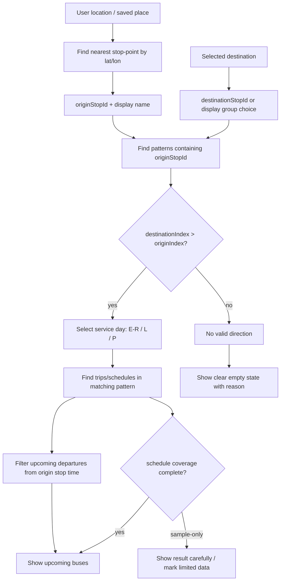

# BUS_LOGIC_LOCK.md

## Status
Canonical bus logic lock for Rakvere city lines.

## Core rule
Rakvere bus logic is pattern + stopId based, not stop-name-only.

## Current confirmed data state
- lines: 1, 2, 3, 5
- stop IDs: 80
- display groups: 49
- runtime line entries: 12
- patterns: 6
- trips/schedules: 74
- build succeeded after data update

## Source files
Source folder:
`C:\Users\Kasutaja\Desktop\Linnaliinid`

Line folders:
- Liin 1
- Liin 2
- Liin 3
- Liin 5

Source semantics:
- TXT files provide stop order / stop IDs / sample stop times.
- PDFs provide timetable/service variants where available.

## Data hierarchy
Line -> Pattern -> ordered stopIds -> stop times/offsets -> service-day trips -> upcoming departures.

## Stop identity rules
- stopId is runtime identity
- stop name is display label
- same-name grouping is display-only
- direction-specific stop IDs must not be merged for routing
- display group may contain several stop IDs, but routing must use selected stopId

## Õie / Tulika locked example
Õie:
- 5901010-1
- 5901011-1

Tulika:
- 5900815-1
- 5900816-1

Line 3 direction-specific order:
- Tõrma - Keskväljak - Tõrma includes Vallimäe -> Tulika 5900815-1 -> Õie 5901011-1 -> Tammiku
- Tõrma - Koidula - Tõrma includes Tammiku -> Õie 5901010-1 -> Tulika 5900816-1 -> Vallimäe

Therefore nearest and routing logic must not collapse Õie/Tulika only by name.

## Nearest stop rule
- nearest stop must use individual stop-point lat/lon
- not display group centroid
- UI may show display name, but internal result must keep stopId

## Destination rule
A valid route exists only when:
- originStopId and destinationStopId are in the same pattern
- destinationIndex > originIndex

If not:
- show clear empty state
- do not silently return empty list

## Upcoming departures rule
- choose service day first: E-R / L / P
- find valid patterns containing origin and optional destination
- filter trips by current time
- compute/show upcoming departures from origin stop time
- if schedule coverage is sample-only, mark limitation clearly

## Mermaid flow

