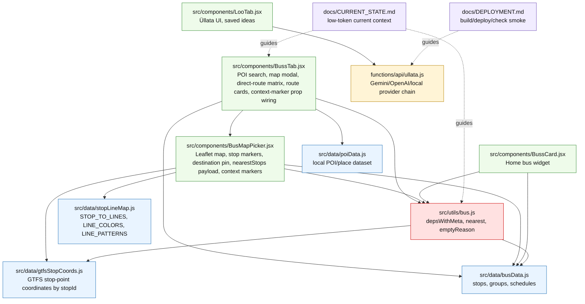
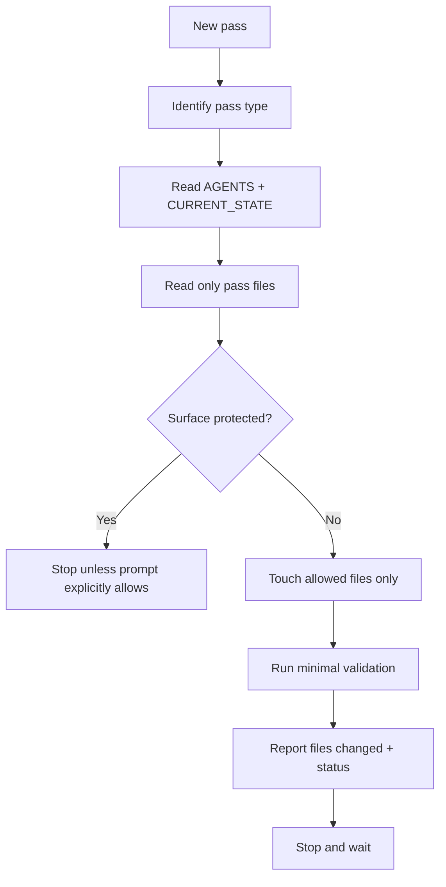

# CODEBASE_IMPACT_MAP

## Purpose

This map defines:
- file responsibility by surface
- dependency/mutation risk
- pass-type based read/touch/avoid/validate expectations
- a low-token guardrail against cross-surface accidental edits

## File responsibility table

| File | Responsibility | Common pass types | Risk | Notes |
|---|---|---|---|---|
| `src/components/BussTab.jsx` | Buss destination UI, POI/place search, direct-route candidate matrix, map modal integration, route cards, context-marker prop wiring | bus-ui, place-search, direct-route-search, map-picker-ui | high | passes `currentPosition`, `nearestOriginStop`, `highlightStopNames`, `selectedStopName` into map surface |
| `src/components/BusMapPicker.jsx` | Leaflet/OSM map surface, destination pin, nearestStops payload, stop marker layer, context markers (`Minu asukoht`, `Lähim peatus`), line badges, line filter visual layer | map-picker, map-picker-ui, map-marker-visuals, map-line-filter | high | owns map marker/filter visual layer; map input aid, not routing engine |
| `src/components/BussCard.jsx` | Home card bus widget | bus-ui, home-widget | medium | keep separate from BussTab unless pass says otherwise |
| `src/utils/bus.js` | `depsWithMeta`, `nearest`, route filtering, `emptyReason` | bus-engine | high | `nearest` uses GTFS-preferred stop-point coords; `depsWithMeta` stays protected |
| `src/data/busData.js` | stops, groups, schedules | bus-data | high | protected timetable/source data |
| `src/data/gtfsStopCoords.js` | verified GTFS stop-point coordinate layer keyed by stopId | bus-data, coord-layer | medium/high | stop-point truth layer for nearest/map markers |
| `src/data/stopLineMap.js` | line metadata layer (`STOP_TO_LINES`, `LINE_COLORS`, `LINE_PATTERNS`) | map-line-color-data, map-line-filter | medium | derived from route-pattern audit data; supports map visuals only |
| `src/data/poiData.js` | local POI/place dataset | poi-data | low/medium | data-only until imported |
| `src/components/LooTab.jsx` | Üllata UI, saved ideas | ullata-ui | medium | unrelated to bus |
| `functions/api/ullata.js` | Gemini/OpenAI/local provider chain | ullata-api | high | API/provider surface |
| `docs/CURRENT_STATE.md` | compact current state | docs/state | low | default read-first |
| `docs/DEPLOYMENT.md` | deploy/env process | deploy | low | source untouched |

## Pass type matrix

| Pass type | READ | TOUCH | NEVER TOUCH | VALIDATE |
|---|---|---|---|---|
| `poi-data` | `AGENTS`, `CURRENT_STATE`, `poiData`, `busData` | `poiData` | `BussTab`, `bus.js`, `functions` | POI validation, build |
| `place-search` | `AGENTS`, `CURRENT_STATE`, `BussTab`, `poiData`, `busData` | `BussTab` | `bus.js` unless proven, Üllata | build, search source checks |
| `bus-ui` | `AGENTS`, `CURRENT_STATE`, `BussTab`, `bus.js`, `busData` | `BussTab` | Üllata/API | build, route smoke |
| `bus-engine` | `AGENTS`, `CURRENT_STATE`, `bus.js`, `busData` | `bus.js` | Üllata/API, unrelated UI | heavy source tests, build, route smoke |
| `map-picker` | `AGENTS`, `CURRENT_STATE`, `BUS_MAP_PICKER_PLAN`, map component, `BussTab` | map component, maybe `BussTab` | `bus.js` unless proven | build, mobile/map smoke |
| `direct-route-search` | `AGENTS`, `CURRENT_STATE`, direct-route plan, `BussTab`, `poiData`, `busData` | `BussTab` | `bus.js` rewrite, transfers | build, route-empty-state/source smoke |
| `map-picker-ui` | `AGENTS`, `CURRENT_STATE`, map UX spec, `BussTab`, `BusMapPicker` | `BussTab`, `BusMapPicker` | `bus.js`, `busData`, Üllata | build, modal/mobile/source smoke |
| `map-marker-visuals` | `AGENTS`, `CURRENT_STATE`, map UX spec, `BusMapPicker` | `BusMapPicker` | routing engine, `busData` | build, marker/source smoke |
| `map-line-color-data` | `AGENTS`, `CURRENT_STATE`, map-context goals doc, route-pattern audit, `stopLineMap` | `stopLineMap` (+ generator script when needed) | routing engine, transfers | build + data/source checks |
| `map-line-filter` | `AGENTS`, `CURRENT_STATE`, map-context goals doc, `BusMapPicker`, `stopLineMap` | `BusMapPicker` | routing engine, `busData`, transfers | build, marker/filter/source smoke |
| `ullata-ui` | `AGENTS`, `CURRENT_STATE`, `LooTab` | `LooTab` | bus files | build, UI/source smoke |
| `ullata-api` | `AGENTS`, `CURRENT_STATE`, `ullata.js` | `ullata.js` | bus files | API smoke |
| `deploy` | `DEPLOYMENT`, `CURRENT_STATE`, git status | none | source | build, deploy, canonical/API smoke |
| `docs` | `AGENTS`, `CURRENT_STATE`, relevant docs | docs only | `src`, `functions`, `package`, `dist` | status only |

## Mermaid — codebase impact map

## Mermaid — pass sniper matrix flow

