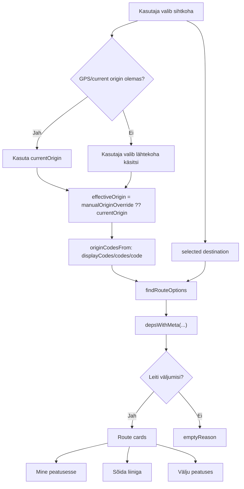
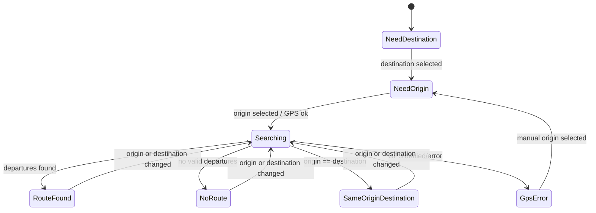
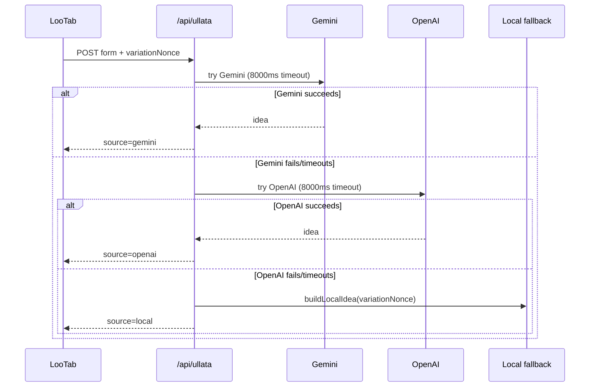
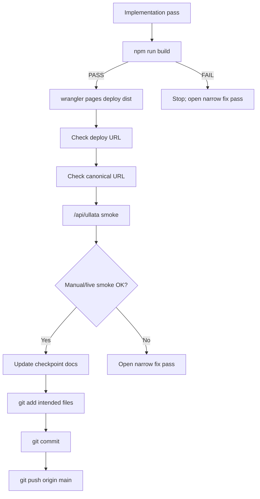
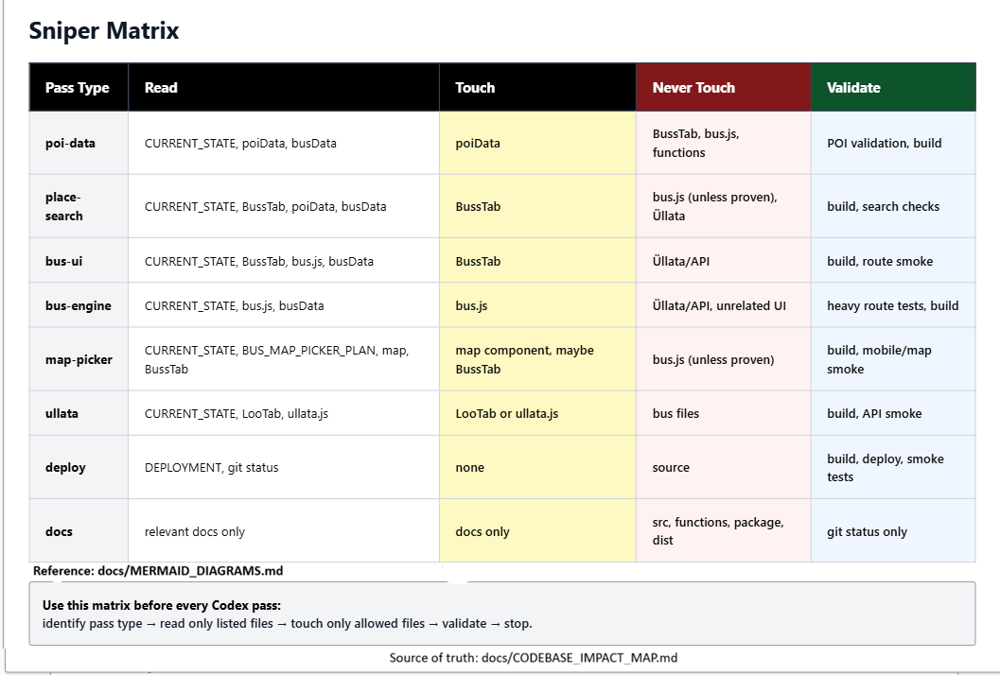

# MERMAID_DIAGRAMS.md

Status: PASS 26A docs-only diagram planning.

Purpose:
- define where Mermaid diagrams add real clarity
- separate source-backed diagrams from future conceptual flows
- avoid mixing planning diagrams with runtime implementation changes

## Diagram opportunities

### 1) Destination-first bus route flow
- Type: `flowchart`
- Source/data: `src/components/BussTab.jsx` (`destination`, `currentOrigin`, `manualOriginOverride`, `effectiveOrigin`, `routeOptions`, `nearest`, `depsWithMeta`)
- Value now: high
- Purpose: show how destination + origin selection becomes route cards

### 2) Bus routing engine flow
- Type: `flowchart`
- Source/data: `src/utils/bus.js` (`resolveStopIds`, `depsWithMeta`, `emptyReason`, service/day and sequence filtering)
- Value now: high
- Purpose: show how origin/destination resolve into departures

### 3) Stop/group/sibling-code model
- Type: `graph` (or `erDiagram` later)
- Source/data: `BUS_DATA.groups`, `BUS_DATA.by_code`, `displayCodes`, `codes`, stop code pairs
- Value now: medium
- Purpose: explain one visible stop name vs multiple direction-specific stop codes

### 4) BussTab UI state machine
- Type: `stateDiagram-v2`
- Source/data: `destination`, `effectiveOrigin`, `gpsState`, `emptyReason`, `routeOptions`
- Value now: high
- Purpose: make empty/error/found states explicit

### 5) Future GPS/map route recommendation flow
- Type: `flowchart`
- Source/data: `docs/BUS_MAP_PICKER_PLAN.md`, `nearest(pinLat, pinLon)`, `destinationCandidates`, `originCandidates`, scoring notes
- Value now: planning-only
- Purpose: map/typed input -> candidate resolution -> existing routing wrapper

### 6) Üllata provider chain
- Type: `sequenceDiagram`
- Source/data: `functions/api/ullata.js` (Gemini, OpenAI, local fallback, timeout, `variationNonce`)
- Value now: high
- Purpose: make Gemini -> OpenAI -> local behavior explicit

### 7) Deploy/checkpoint workflow
- Type: `flowchart`
- Source/data: build, deploy, canonical/live smoke, API smoke, checkpoint, commit/push
- Value now: high
- Purpose: enforce release discipline

## Initial Mermaid diagrams

### A) Destination-first bus flow (source-backed)

### B) BussTab UI state machine (source-backed)

### C) Üllata provider chain (source-backed)

### D) Deploy/checkpoint workflow (conceptual, process diagram)

## Notes

- Diagrams A/B/C are source-backed by current files.
- Diagram D is intentionally conceptual (process governance).
- Future map diagrams remain planning-only until PASS 25C/25D/25E work is explicitly unlocked.

## Codebase impact / sniper maps

- Mermaid source-of-truth for impact/surface diagrams lives in:
  - `docs/CODEBASE_IMPACT_MAP.md`
- Any future Figma/FigJam export should be generated from this Mermaid source, not freehand memory.
- Figma/FigJam input scope should include only:
  - Mermaid diagram content
  - legend
  - color rules

## Figma/FigJam visual

- A Figma/FigJam visual exists for the AnniVibe Sniper Matrix / codebase impact map.
- Visual asset path:
  - `docs/assets/annivibe-sniper-matrix.png`
- Figma/FigJam link:
  - `https://www.figma.com/make/NLhNtsH62eXlt3XLtqZ2wM/Create-Engineering-Diagram?t=cXNGGnLW3YYQ6KIt-20&fullscreen=1`
- Purpose:
  - developer-facing quick reference for Codex pass type -> read/touch/never-touch/validate
- The image is a visual aid only.
- Source of truth remains:
  - `docs/CODEBASE_IMPACT_MAP.md`
- Future Figma/FigJam updates must be generated from repo Mermaid/docs, not freehand memory.

