# PROJECT_MAP.md

Status: canonical project map for AnniVibe v1.

Purpose:
- give AI passes a fast visual map of truth, runtime, deploy, and risk surfaces
- reduce scope drift
- prevent accidental broad refactors

Do not treat this as architecture permission.
`docs/ACTIVE_SCOPE_LOCK.md` still controls what is allowed now.

```mermaid
flowchart TD
  %% Truth layer
  subgraph TL["Truth / Governance Layer"]
    AG["AGENTS.md"]
    PM["docs/PROJECT_MEMORY.md"]
    TI["docs/TRUTH_INDEX.md"]
    ASL["docs/ACTIVE_SCOPE_LOCK.md"]
    AC["docs/ACCEPTED_CHECKPOINTS.md"]
    CBM["docs/CODEBASE_MAP.md"]
    CS["docs/CHANGE_SURFACES.md"]
    PDF["docs/POST_DEPLOY_FOLLOWUPS.md"]
  end

  AG --> PM
  PM --> TI
  TI --> ASL
  ASL --> AC
  CBM --> CS
  PDF -. optional follow-up .-> ASL

  %% Runtime app
  subgraph APP["Canonical Runtime App"]
    IDX["index.html"]
    MAIN["src/main.jsx"]
    APPX["src/App.jsx<br/>app shell + nav + tab wiring"]

    KODU["Kodu<br/>inline in App.jsx"]
    BUSS["src/components/BussTab.jsx"]
    BUSSCARD["src/components/BussCard.jsx"]
    LOO["src/components/LooTab.jsx"]
    PAEVIK["src/components/PaeviikTab.jsx"]
    TUGI["src/components/TugiTab.jsx"]
    SEADED["src/components/SeadedTab.jsx"]

    IDX --> MAIN --> APPX
    APPX --> KODU
    APPX --> BUSS
    APPX --> LOO
    APPX --> PAEVIK
    APPX --> TUGI
    APPX --> SEADED
    KODU --> BUSSCARD
  end

  %% Data/state layer
  subgraph STATE["State / Data Layer"]
    SET["src/hooks/useSettings.js<br/>profile + places"]
    PLACES["src/hooks/useSavedPlaces.js<br/>{ name, address, lat, lon }"]
    DIARY["src/hooks/useDiary.js<br/>PIN + entries"]
    BUSDATA["src/data/busData.js"]
    BUSUTIL["src/utils/bus.js"]
  end

  KODU --> SET
  KODU --> PLACES
  BUSSCARD --> PLACES
  BUSS --> PLACES
  BUSS --> BUSUTIL
  BUSUTIL --> BUSDATA
  SEADED --> SET
  SEADED --> PLACES
  SEADED --> DIARY
  PAEVIK --> DIARY

  %% API / backend route
  subgraph API["API Boundary"]
    UIFE["LooTab ask / Üllata request"]
    ROUTE["functions/api/ullata.js<br/>/api/ullata"]
    OPENAI["OpenAI Responses API<br/>server-side only"]
    LOCAL["local deterministic fallback"]
  end

  LOO --> UIFE
  UIFE --> ROUTE
  ROUTE --> OPENAI
  ROUTE --> LOCAL
  OPENAI -. if key missing/fails .-> LOCAL

  %% Build/deploy
  subgraph DEPLOY["Deploy Pipeline"]
    GH["GitHub<br/>Fuuduuu/AnniVibez main"]
    CF["Cloudflare Pages<br/>annivibe"]
    BUILD["npm run build"]
    DIST["dist/"]
    FUNCS["functions/"]
    LIVE["https://annivibe.pages.dev"]
  end

  GH --> CF --> BUILD --> DIST --> LIVE
  CF --> FUNCS --> LIVE

  %% Scope locks
  subgraph LOCKS["Scope Locks"]
    V1["V1 in scope:<br/>Kodu, Buss, Loo, Päevik, Tugi, Seaded"]
    OUT["V1 out of scope:<br/>Trends, Loo oma trend"]
    RULE["Next work:<br/>one narrow pass only"]
  end

  ASL --> V1
  ASL --> OUT
  ASL --> RULE

  %% Styling
  classDef high fill:#ffe5e5,stroke:#c0392b,color:#111;
  classDef medium fill:#fff4d6,stroke:#b9770e,color:#111;
  classDef safe fill:#e9f8ef,stroke:#239b56,color:#111;
  classDef truth fill:#eef2ff,stroke:#5b5fc7,color:#111;
  classDef deploy fill:#e8f4ff,stroke:#2874a6,color:#111;

  class APPX,SET,PLACES,DIARY,LOO,ROUTE,BUSUTIL,BUSDATA high;
  class TUGI,BUSSCARD safe;
  class PM,TI,ASL,AC,CBM,CS truth;
  class GH,CF,BUILD,DIST,FUNCS,LIVE deploy;
```

## Change-risk legend

- Red = high-impact / cross-cutting
- Green = local-safe
- Blue = deployment/runtime pipeline
- Purple = governance/truth layer

## Current active principle

Do not start broad implementation from this map.

Correct order:
1. read truth docs
2. check active lock
3. choose one narrow pass
4. build/test
5. checkpoint
