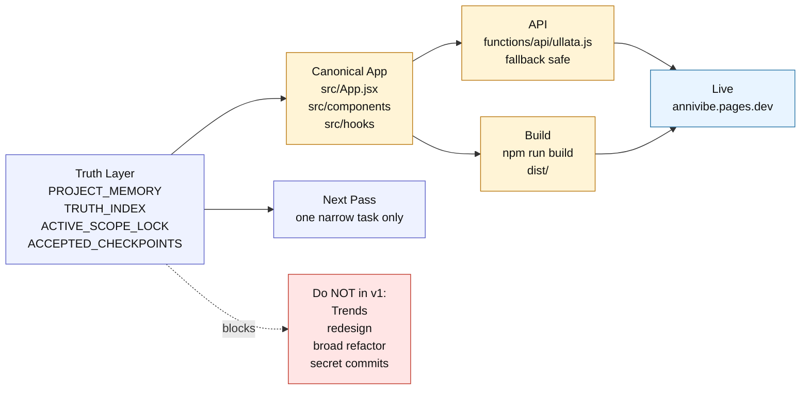

# PROJECT_MINI_MAP.md

Status: one-screen map for fast AI orientation.

## Use this when starting a new AI pass

Ask:
1. What does `ACTIVE_SCOPE_LOCK.md` allow?
2. Is this a docs pass, QA pass, bugfix pass, or deploy pass?
3. What single file/surface is being touched?
4. What must stay untouched?
5. What checkpoint proves the pass is complete?
